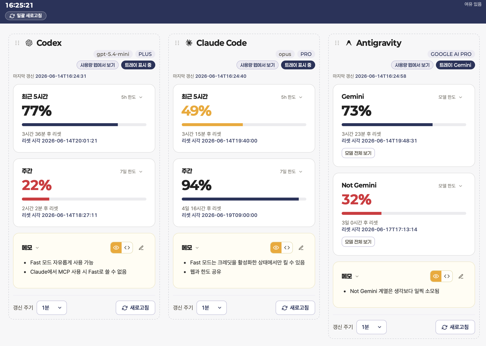
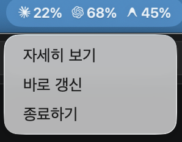
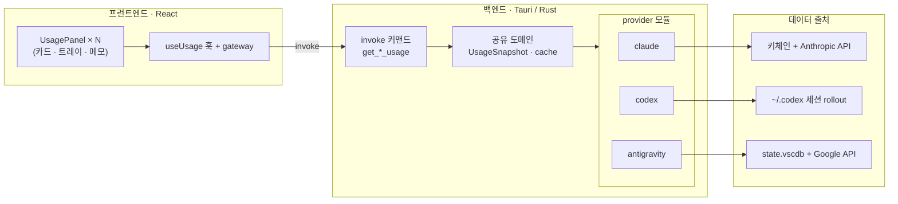

# 한도바 (Hando-Bar)

> Codex · Claude Code · Antigravity 한도를 메뉴바에서 한눈에 보는 macOS 트레이 앱


## 미리보기

| 패널 | 메뉴바 |
| --- | --- |
|  |  |

- 도구별 패널이 잔여 한도 카드·리셋 시각·모델 칩을 한 화면에 보여줌
- 메뉴바 아이콘에는 선택한 항목의 잔여 %를 조합해 표시
- 컨텍스트 메뉴에서 상세 보기, 즉시 갱신, 종료를 바로 실행

## 개요

- 세 AI 도구의 잔여 한도를 메뉴바에 상주시켜 흘끔 확인하는 가벼운 유틸리티
- macOS 전용 / 별도 로그인 없음(각 도구의 로컬 자격증명 재사용)
- [CodexBar](https://github.com/steipete/CodexBar)에서 영감을 받음

## 표시 항목

-  **Claude Code** — 5시간 · 주간 잔여량 + 요금제
-  **Codex** — 5시간 세션 · 주간 잔여량 + 요금제
-  **Antigravity** — Gemini · Not-Gemini(Claude·OSS 등) 그룹별 잔여량 + 추천 모델 칩 + 요금제

## 기능

- 한도별 카드 + 리셋까지 남은 시간 표시
- provider별 요금제 배지 표시
- 잔여량 색상 경고: 60% 이하 주황 · 40% 이하 빨강 + 경고 배너
- 트레이 아이콘에 원하는 항목의 잔여 % 선택 표시
- 메뉴바 컨텍스트 메뉴에서 상세 보기·바로 갱신·종료 실행
- 카드 접기/펼치기 · 모델 칩 보이기/숨기기 · 자유 메모

## 데이터 출처

-  **Claude** — 키체인 토큰 → `/api/oauth/usage`
-  **Codex** — `~/.codex` 세션 rollout의 `rate_limits` 스냅샷
-  **Antigravity** — IDE의 OAuth 토큰으로 자체 쿼터 직접 조회

## 구조



## 설치

- [Releases](../../releases)에서 `.dmg` 다운로드 (Intel · Apple Silicon universal 빌드)
- ad-hoc 서명 및 미공증 빌드이므로 다운로드한 앱의 첫 실행은 Gatekeeper 차단 발생
- 허용 방법: **시스템 설정 → 개인정보 보호 및 보안** → 아래로 스크롤 → "'HandoBar'이(가) 차단되었습니다" 옆 **"그래도 열기"** 클릭
- 터미널 대안: `xattr -dr com.apple.quarantine /Applications/HandoBar.app` (앱 경로에 맞게 조정)
- 직접 빌드(`pnpm tauri build`)는 다운로드 앱이 아니므로 Gatekeeper 차단 없음
- 사용량 조회 시 키체인 접근 허용 프롬프트 → "항상 허용"(빌드 변경 시 재요청 가능)

## 개발

```sh
brew install node pnpm rust
pnpm install
pnpm tauri dev      # 개발 모드
pnpm tauri build    # 로컬 빌드 (.app)
```

- 스택: Tauri 2(Rust) + React 19 + TypeScript (상단 뱃지 참고)
- 릴리스: 버전 태그 push → GitHub Actions 빌드 → Release에 `.dmg` 첨부 (`.github/workflows/release.yml`)
- 구조·작업 규칙 상세: [AGENTS.md](AGENTS.md)

## 라이선스

- [MIT](LICENSE)
